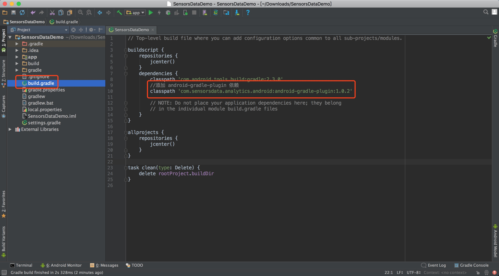

[](https://www.apache.org/licenses/LICENSE-2.0.html)
[](https://bintray.com/zouyuhan/maven/SensorsAnalyticsSDK/_latestVersion)

# Sensors Analytics

This is the official Android SDK for Sensors Analytics.

# 开源社区
神策 Android & iOS SDK 开源社区正在筹建中，敬请期待~

## Easy Installation

 __Gradle 编译环境（Android Studio）__

第一步：在 **project** 级别的 build.gradle 文件中添加 Sensors Analytics android-gradle-plugin 依赖：

```android
buildscript {
    repositories {
        jcenter()
	//添加 Sensors Analytics maven 库地址
        maven {
            url 'https://dl.bintray.com/zouyuhan/maven'
        }
    }
    dependencies {
        classpath 'com.android.tools.build:gradle:2.2.3'
        //添加 Sensors Analytics android-gradle-plugin 依赖
        classpath 'com.sensorsdata.analytics.android:android-gradle-plugin2:3.0.4'
    }
}

allprojects {
    repositories {
        jcenter()
	//添加 Sensors Analytics maven 库地址
        maven {
            url 'https://dl.bintray.com/zouyuhan/maven'
        }
    }
}
```

如下示例图：


第二步：在 **主 module** 的 build.gradle 文件中添加 com.sensorsdata.analytics.android 插件、Sensors Analytics SDK 依赖：

```android
apply plugin: 'com.android.application'
//添加 com.sensorsdata.analytics.android 插件
apply plugin: 'com.sensorsdata.analytics.android'

dependencies {
   compile 'com.android.support:appcompat-v7:25.1.1'
   //添加 Sensors Analytics SDK 依赖
   compile 'com.sensorsdata.analytics.android:SensorsAnalyticsSDK:3.1.0'
}
```
SensorsAnalyticsSDK 的最新版本号请参考 [github 更新日志](https://github.com/sensorsdata/sa-sdk-android/releases)。

如下示例图：


Android SDK 要求最低系统版本为 API 11（Android 3.0），特别地，AutoTrack功能要求系统最低版本为 API 14 （Android 4.0），可视化埋点功能要求最低系统版本为 API 16（Android 4.1）。目前，Android SDK (aar格式) 大小约为 230 KB。

## 集成文档

请参考神策官网 [Android SDK 集成文档](http://www.sensorsdata.cn/manual/android_sdk.html)

或者加入神策官方 Android & iOS SDK QQ 讨论群：<br><br>


## 新书推荐
神策数据出品的[《Android 全埋点解决方案》](https://u.jd.com/2JFaeG)发售啦！！！

[](https://u.jd.com/2JFaeG)

## 感谢
[mixpanel-android](https://github.com/mixpanel/mixpanel-android) 

## License

Copyright 2015－2019 Sensors Data Inc.

Licensed under the Apache License, Version 2.0 (the "License");
you may not use this file except in compliance with the License.
You may obtain a copy of the License at

http://www.apache.org/licenses/LICENSE-2.0

Unless required by applicable law or agreed to in writing, software
distributed under the License is distributed on an "AS IS" BASIS,
WITHOUT WARRANTIES OR CONDITIONS OF ANY KIND, either express or implied.
See the License for the specific language governing permissions and
limitations under the License.

**禁止一切基于神策数据开源 SDK 的所有商业活动！**
